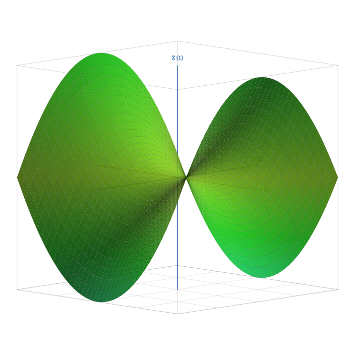

Calculocus — Graphing Calculator

https://zacharyfairburn.github.io/calculocus/

Calculocus ( CAL-CUE-LOCUS ) is an all-in-one graphing calculator suite that works offline, built with React and TypeScript.

[Features]

- Light & dark mode display options
- Computer algebra system for factoring, expanding, and simplifying expressions
- Differentiation, integration, and limit calculation tools
- Interactive 2D canvas for Cartesian, polar, parametric, and implicit curves
- 3D surface rendering with wireframe controls and contour maps
- Digital math keyboard and KaTeX math formatting
- Matrix and vector calculations
- Table, scatterplot, and statistical functions
- Exporting and sharing 2D graphs, 3D graphs, and contour maps as .PNG files
- Importing and exporting .CSV spreadsheets for stat calculations
- Imaginary and complex number support
- Undo & redo functionalities
- Cartesian and polar coordinate planes
- Mobile device compatibility

[Tech Stack]

- React 19 and TypeScript
- Vite
- Tailwind CSS
- HTML5 Canvas
- KaTeX

[Disclaimer]

(Project was primarily generated through AI prompting using Google AI Studio, to include translating from C# to TypeScript)

[License]

This project is licensed under the GNU General Public License v3.0 (GPL-3.0).
